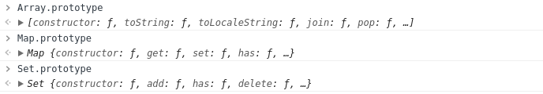

## \_\_proto__
每个JS对象一定对应一个原型对象，并从原型对象继承属性和方法
对象__proto__属性的值就是它所对应的原型对象。
## prototype
ES规范规定：每个对象都有__proto__属性来标识自己所继承的原型，只有函数才有prototype属性。

当你创建函数时，JS会为这个函数自动添加prototype属性，值是空对象。而一旦你把这个函数当作构造函数（constructor）调用（即通过new关键字调用），那么JS就会帮你创建该构造函数的实例，实例继承构造函数prototype的所有属性和方法（实例通过设置自己的__proto__指向承构造函数的prototype来实现这种继承）。
## 原型链
JS通过__proto__和prototype的合作实现了原型链，以及对象的继承。

构造函数，通过prototype来存储要共享的属性和方法，也可以设置prototype指向现存的对象来继承该对象。

对象的__proto__指向自己构造函数的prototype。obj.\_\_proto__.\_\_proto__...的原型链由此产生，包括我们的操作符instanceof正是通过探测obj.\_\_proto__.\_\_proto__... === Constructor.prototype来验证obj是否是Constructor的实例。

## Function.prototype
**Function.prototype是个不同于一般函数（对象）的函数（对象）。**
1. Function.prototype像普通函数一样可以调用，但总是返回undefined。
1. 普通函数实际上是Function的实例，即普通函数继承于Function.prototype。func.\_\_proto__ === Function.prototype。
1. Function.prototype继承于Object.prototype，并且没有prototype这个属性。func.prototype是普通对象。
1. Function.prototype其实是个另类的函数，可以独立于/先于Function产生。

**Function.prototype 为什么是函数?**



可以看出，Array.prototype 是 Array 类型，Map.prototype 是 Map 类型，Set.prototsype 是 Set 类型

所以，为了保持一致性，Function.prototype 也应该是 Function 类型

## 结论
```javascript
/**
*   实例的 __proto__ 指向构造函数的 prototype
**/
function A(){...}  // 创建A函数时js同时自动生成A.prototype

A.__proto__ === Function.prototype // A是通过 Function 构造函数生成的

A.prototype.__proto__ === Object.prototype // 原型对象是通过 Object 构造函数生成的

Object.prototype.__proto__ === null //ES规范规定

Function.prototype.__proto__ === Object.prototype // ES规范规定

Object.__proto__ === Function.prototype // Object构函数是通过 Function 构造函数生成的

Function.__proto__ === Function.prototype // Function构函数是通过 Function 构造函数生成的

var a = new A() // new生成实例

a.__proto__ === A.prototype // new实例通过设置自己的__proto__指向承构造函数的prototype来实现这种继承

A.prototype.constructor = A // 原型的构造器
  
a.constructor === A // 当获取 a.constructor 时，其实 a 中并没有 constructor 属性,当不能读取到constructor 属性时，会从 a 的原型也就是 A.prototype 中读取，正好原型中有该属性
```
## 参考链接
- https://github.com/xiedacon/blog/issues/9
- https://github.com/mqyqingfeng/Blog/issues/2
- https://github.com/creeperyang/blog/issues/9